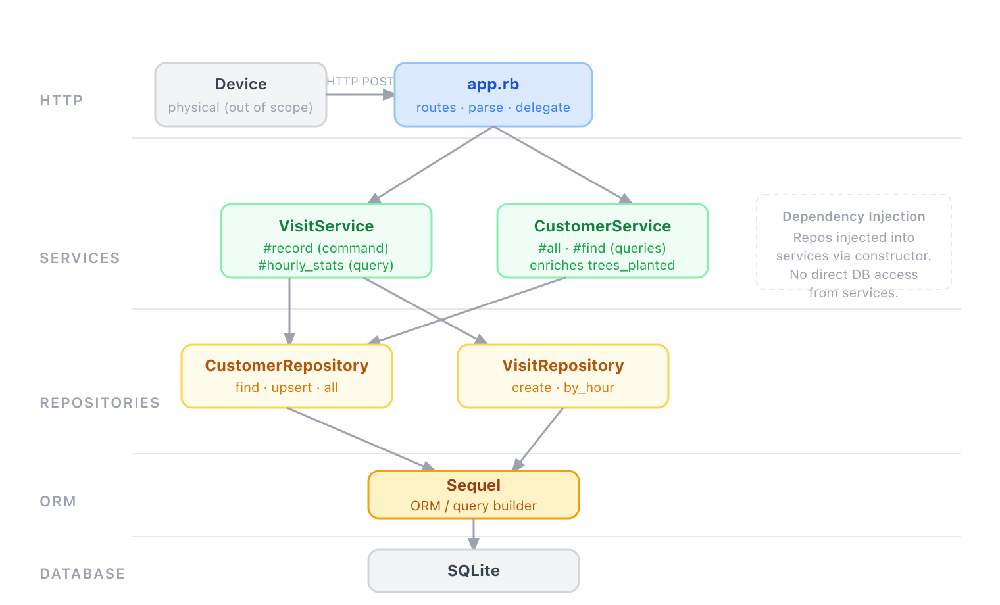

# treekr

A loyalty system where shop visits generate trees planted for customers. A physical device detects each visit and sends an HTTP event to the service.

## Requirements

- Ruby 4.0+ (local setup)
- Docker and Docker Compose (containerized setup)

## Getting started

### Local

```bash
bundle install
bundle exec rake db:migrate
bundle exec rackup config.ru
```

The app runs on `http://localhost:4567`.

To seed sample data:

```bash
bundle exec ruby db/seeds.rb
```

### Docker

```bash
docker compose up
```

The app runs on `http://localhost:4567`. The database is stored in a named volume and persists across restarts.

To seed sample data into the running container:

```bash
docker compose exec web bundle exec ruby db/seeds.rb
```

## Environment variables

| Variable          | Default              | Description                                   |
|-------------------|----------------------|-----------------------------------------------|
| `DATABASE_URL`    | `sqlite://treekr.db` | Sequel-compatible connection string           |
| `VISITS_PER_TREE` | `5`                  | Number of visits required to plant one tree   |

`VISITS_PER_TREE` is validated at startup and must be a positive integer.

## API

### POST /api/visits

Records a visit from a device.

```bash
curl -X POST http://localhost:4567/api/visits \
  -H 'Content-Type: application/json' \
  -d '{"customer_id": "alice_01", "device_id": "door_a"}'
```

Returns the updated customer with `trees_planted`.

### GET /api/customers

Returns all customers.

```bash
curl http://localhost:4567/api/customers
```

### GET /api/customers/:id

Returns a single customer.

```bash
curl http://localhost:4567/api/customers/alice_01
```

### GET /api/stats/hourly

Returns visits per hour for the last 24 hours (always 24 buckets).

```bash
curl http://localhost:4567/api/stats/hourly
```

## Technical decisions

### Language and framework

Ruby is the language with the most control and familiarity for this project. Sinatra was chosen over Rails because the scope does not justify the overhead Rails brings — the same reasoning that would lead to FastAPI over Django in Python, or Slim/Flight over Laravel in PHP.

### Persistence

SQLite via Sequel. No server required, and migrating to PostgreSQL is a one-line change to the connection string. Persistent storage was chosen from the start under the assumption that the project is intended to scale — in-memory storage would be a dead end.

### Architecture

The project applies a **Layered Architecture** with a **Repository Pattern** and **Dependency Injection**:



Services receive repositories as constructor dependencies — they never instantiate them directly. This keeps the business logic testable in isolation and the data access layer swappable.

Hexagonal Architecture was considered but ruled out as over-engineering for this scope. Instead, the simpler parts of that philosophy were borrowed: clear boundaries between layers, and adapters (repositories) that the core (services) depends on through abstractions rather than concrete implementations.

### Service layer

Business logic lives in `VisitService` and `CustomerService`, not in `app.rb`. The route handlers parse the request and delegate — they contain no logic of their own. This follows the **Service Pattern** and keeps the HTTP layer thin.

### Command-Query Separation

`VisitService#record` is a command: it writes and returns `true`. `CustomerService#all` and `#find` are queries: they read, enrich with `trees_planted`, and return data. Neither type crosses into the other's responsibility.

### SOLID

The applicable SOLID principles are applied throughout:

- **Single Responsibility** — each class has one reason to change.
- **Open/Closed** — repositories can be swapped without modifying the services that use them.
- **Dependency Inversion** — services depend on injected abstractions, not concrete Sequel calls.

### Customer ID as alphanumeric string

Customer IDs are alphanumeric strings, not auto-incremented integers. The physical device already knows the customer's identity and sends it directly — the service does not generate identifiers. This enforces a static, externally-defined identification scheme that decouples the database primary key from any internal sequence. IDs are indexed to keep lookups efficient despite the string type.

### `trees_planted` is not stored

Calculated on the fly as `total_visits / VISITS_PER_TREE` (integer division). Storing a derived value adds surface area for inconsistency with no real benefit.

### `last_connection` is cached on the customer

Updated on every visit to avoid an extra `MAX(visited_at)` query when reading customer data.

### `visited_at` is set server-side

The device sends `customer_id` and `device_id` only — the timestamp is assigned by the server to avoid clock drift from devices.

### Error handling

Errors are managed at two levels:

- **Repositories** — catch `Sequel::Error` and re-raise it as `PersistenceError`, preventing database implementation details from leaking into upper layers.
- **app.rb** — registers global error handlers for `ArgumentError` (400) and `PersistenceError` (500). Routes contain no rescue blocks; errors propagate up and are handled in one place.

This approach was kept intentionally simple. A production system would likely introduce more granular exception types. Observability was ruled out as out of scope for this assessment.

### No API versioning

The current scope does not justify it. If breaking changes become necessary, versioning can be introduced at that point.

### Development practices

- **TDD** — tests were written before the implementation throughout the project. Red → green → refactor. This discipline is designed to be extended as the project grows.
- **RuboCop** — static analysis enforced on every change (`rubocop-rspec` and `rubocop-sequel` included).
- **Pull Requests** — every feature developed on its own branch and integrated via PR, even without a team doing formal code review. PRs serve as a change log and a forcing function for reviewable, focused commits.

## Limitations

- No authentication. The API is designed for trusted internal devices on a private network.
- SQLite is not suited for high-concurrency write workloads. For production scale, switch to PostgreSQL.
- No observability. There is no structured logging, metrics, or error tracking. This is a significant gap for any production deployment and would be the first area to address when scaling the system.
